# 简明英语语法grammar
> zzy_2019

英语有三个重要特征。

* 屈折变化较少：虽然是典型的屈折语，但除名词、代词、动词、形容词和副词有变化外，数词、介词、连词、冠词和感叹词都是不变的。
* 词汇的开放性：英语词汇来源广泛，一半为日耳曼语族词汇，一半为罗曼语族词汇，还有许多从希腊语、荷兰语、意大利语、西班牙语、德语、阿拉伯语以及其它语言引进的词汇。
* 句法的规律性：英语主要有三种句子结构，即简单句、并列句和复合句；词序比较固定。

## 00. 一些重要概念
- 语法（grammar）：词法+句法
- 词法（morphology）：关于**语素**的规则
- 句法（syntax）：关于**结构**的规则

## 01. 词类
英语的词有**实词**(notional word)与**虚词**(form word)两种。

### 1.1 实词
实词都有实义，共有六类：
* **名词**（noun，缩写式为 n. ）：表示人、地点、事物或概念。，如 book，water。
* **代词**（pronoun，缩写式为 pron. ）：代替名词或名词短语，以避免重复，如 I，you。
* **形容词**（adjective，缩写式为 a.或 adj. ）：修饰名词或代词，描述其性质或状态，如 clear，happy。
* **数词**（numeral，缩写式为 num. ），如 four，sixty。
* **动词**（verb，缩写式为 v. ）：表示动作、存在或状态，如 come，take。
* **副词**（adverb，缩写式为 ad. 或 adv. ）：修饰动词、形容词或其他副词，描述其方式、时间、地点、程度等，如 here，today。

### 1.2 虚词
虚词没有实义，共有四类：
* **冠词**（article，缩写式为 art. ）：限定名词的范围或数量，如 a，the。
* **介词**（preposition，缩写式为 prep. ）：表示名词或代词与句子中其他部分的关系，如 of，to。
* **连词**（conjunction，缩写式为 conj. ）：连接词、短语或句子，如 and，or。
* **感叹词**（interjection，缩写式为 int. ）：表达情感或反应，通常独立使用，如 oh，alas。
yes 和 no 可列入副词一类，因为它们很像用作句子独立成分的副词。

英语里有不少词可属于几个不同词类，如 study 既可属于动词，亦可属于名词；fast 既可属于形容词，亦可属于副词；for 既可属于介词，亦可属于连词；after 既可是介词和连词，又可是副词。

三种由短语构成的词类：
* 短语动词（phrasal verb），如 get up，call on，take care of。
* 短语介词（phrasal preposition），如 because of，instead of，in front of。
* 短语连词（phrasal conjunction），如 as if，so that，as long as。
此外，还有一种叫做从属关联词（subordinate correlative）的词类，即**引导从句**的连词、疑问代词、疑问副词、关系代词、关系副词、缩合连接代词和缩合连接副词。

## 02. 句子
句子（sentence）是具有主语部分和谓语部分并有完整意义的可以独立的一组词。

### 2.1 句子的基本结构
在英语里，句子的基本结构有下列五种：
* **主语+谓语**（SV），如：
（1）Day dawns. 天亮了。
* **主语+谓语+宾语**（SVO），如：
（2）Ruth understands French. 露丝懂法语。
* **主语+谓语+间接宾语+直接宾语**（SVOO），如：
（3）He told us the whole story. 他把全部经过告诉了我们。
* **主语+谓语+主语补语**（SVC）或 **主语+连系动词+表语**（SLP），如：
（4）He died a poor man. 他穷困而死。
（5）Tom’s father is a professor. 汤姆的父亲是一位教授。
* **主语+谓语+宾语+宾语补语**（SVOC），如：
（6）He found George intelligent. 他发现乔治很聪明。

### 2.2 按句子结构分类
根据句子的结构，句子可分为：
* **简单句**（simple sentence），一个含有主语（或并列主语）和谓语（或并列谓语）的句子。
如：
（7）Thomas Edison was born in Milan, Ohio, on February 11, 1847. 托马斯•爱迪生 1847 年 2月 11 日生于俄亥俄州的米兰。
（8）Fire and water do not agree. 水火不相容。
（9）Caroline came into the classroom and sat down. 卡罗琳走进教室坐了下来。
* **并列句**（compound sentence），由等立连词把两个或两个以上的简单句（叫做分句）合成的句子。如：
（10）I came home early, but she remained to the end of the concert. 我很早就回家了，而她却待到音乐结束。
* **复合句**（complex sentence），由关联词把主句和一个或一个以上从句合成的句子。如：
（11）He said he would come in the evening. 他说他晚上来。
* 如果并列句中的两个分句又内含从句的话，那就成为一种更加复杂的**并列复合句**（compound complex sentence）。如：
（12）While the men worked to strengthen the dam, the rain continued to fall, and the river, which was already well above its normal level, rose higher and higher. 在人们奋力加固堤坝时，雨继续下个不停；早已大大超过正常水位的河水，越涨越高。

### 2.3 按目的或用途分类
根据句子的目的或用途，句子又可分为：
* **陈述句**（declarative sentence）用以陈述事实。如：
（13）The sun rises in the east. 太阳从东方升起。
* **疑问句**（interrogative sentence）用以提出问题。如：
（14）Who is standing at the window? 谁站在窗前？
* **祈使句**（imperative sentence）用以表示请求。如：
（15）Open the window, please. 请把窗户打开。
* **感叹句**（exclamatory sentence）用以表示喜怒哀乐等强烈感情。如：
（16）How spotless the snow is! 多么洁白无瑕的雪啊！

### 2.4 句子成分
一个句子一般皆由两部分组成，即==主语部分==（subject group）和==谓语部分==（predicate group）。
如：
（1）Professor Ward teaches English to university students. 沃德教授给大学生教英语。
句中的 Professor Ward 即是主语部分，teaches English to university students 即是谓语部分

**句子成分**（members of the sentence）是句子中起一定功用的组成部分。句子由各个句子成分所构成。
::: tip 句子成分
==短语、非谓语动词、各种从句实际上都是在充当一定的**句子成分**。==

* ==主语==：名词、名词短语、名词性从句、非谓语动词
* ==谓语==：动词、动词短语
* ==宾语==：名词、名词短语、名词性从句、非谓语动词
* ==表语==：名词、形容词、名词短语、形容词短语、名词性从句、非谓语动词
* ==定语==：形容词、形容词短语、形容词性从句、非谓语动词
* ==状语==：副词、副词短语、副词性从句、非谓语动词
:::

```mermaid
%% 统一体系：把“形式”按颜色分块，再指向对应成分
%% 一图看清“哪些形式能当哪些成分”，绝对不乱

flowchart TD
    %% ============================================================
    %% 1. 先画“形式”池，用不同颜色框起来，放在顶部
    %% ============================================================

        subgraph 名词类形式 ["🔵 名词类形式"]
            direction LR
            N["名词"]
            NP["名词短语"]
            NC["名词性从句"]
        end

        subgraph 动词类形式 ["🔴 动词类形式"]
            direction LR
            V["动词"]
            VP["动词短语"]
        end

        subgraph 形容词类形式 ["🟢 形容词类形式"]
            direction LR
            ADJ["形容词"]
            ADJP["形容词短语"]
            AdjC["形容词性从句"]
        end

        subgraph 副词类形式 ["🟡 副词类形式"]
            direction LR
            ADV["副词"]
            ADVP["副词短语"]
            AdvC["副词性从句"]
        end

        subgraph 非谓语动词 ["🟣 非谓语动词"]
            direction LR
            NON["to do / doing / done"]
        end

    %% ============================================================
    %% 2. 再画“句子成分”池，放在底部
    %% ============================================================

        subgraph 句子成分 ["句子成分"]
            direction LR
            S["主语"]
            P["谓语"]
            O["宾语"]
            C["表语"]
            A["定语"]
            B["状语"]
        end

    %% ============================================================
    %% 3. 最后画箭头：只从“形式”指向“成分”，一眼看清
    %% ============================================================

        %% ---- 名词类 ----
        N  --> S & O & C
        NP --> S & O & C
        NC --> S & O & C

        %% ---- 动词类 ----
        V  --> P
        VP --> P

        %% ---- 形容词类 ----
        ADJ  --> C & A
        ADJP --> C & A
        AdjC --> A

        %% ---- 副词类 ----
        ADV  --> B
        ADVP --> B
        AdvC --> B

        %% ---- 非谓语动词 ----
        NON --> S & O & C & A & B

    %% 节点样式：统一大小，颜色按块区分
    classDef noun fill:#E3F2FD,stroke:#1976D2,stroke-width:2px,color:#000
    classDef verb fill:#FFEBEE,stroke:#D32F2F,stroke-width:2px,color:#000
    classDef adj fill:#E8F5E9,stroke:#388E3C,stroke-width:2px,color:#000
    classDef adv fill:#FFF8E1,stroke:#F57C00,stroke-width:2px,color:#000
    classDef non fill#F3E5F5,stroke:#7B1FA2,stroke-width:2px,color:#000
    classDef func fill:#FAFAFA,stroke:#424242,stroke-width:3px,color:#000

    class N,NP,NC noun
    class V,VP verb
    class ADJ,ADJP,AdjC adj
    class ADV,ADVP,AdvC adv
    class NON non
    class S,P,O,C,A,B func
```

句子成分共有六种：
* **主语**（subject）是一句的主体，是全句述说的对象，常用名词或相当于名词的词担任，一般置于句首。如：
（2）==The sun== is shining in our faces. 阳光正照射在我们脸上。
（3）==I== respect his privacy. 我尊重他的隐私权。
* **谓语**或谓语动词（predicate or predicate verb）是说明主语的动作或状态的，常用动词担任，置于主语之后。如：
（4）Twilight ==was falling== as Martin left the fruit store. 当马丁离开水果店时，黄昏开始降临。
（5）The play ==began== at eight, so they must dine at seven. 戏 8 点钟开演，所以他们必须 7 点钟吃饭。
“谓语或谓语动词”专指动词部分（包括动词短语）。它与“谓语部分”不同，二者不可混淆。

* **宾语**（object）是表示及物动词的**动作对象**（动作承受者）和介词所联系的对象的，常由名词或相当于名词的词担任。置于及物动词或介词之后。如：
（6）One must endorse ==a cheque== before one cashes it. 支票兑现前必须先签字。
（7）Thomas received ==a warning== for speeding. 托马斯收到了一张超速行车警告单。
（8）She gave ==a roar of pain==. 她发出一声痛苦的吼叫。
* **补语**（complement）和**表语**（predicative），补语是用来补充主语和宾语的意义的，一般都着重说明主语或宾语的特征，常由**名词**或**形容词**担任。表语就是位于连系动词之后的主语补语。如：
（9）Hill was declared ==the winner of the fight==. 希尔被宣布为这次拳击赛的获胜者。（主语补语）
（10）I consider the book ==expensive==. 我认为这本书贵。（宾语补语）
（11）John Stuart Mill was ==an early feminist==. 约翰•斯图尔特•米尔是早期的女权主义者。（表语）

* **定语**（attribute）是限定或修饰名词或相当于名词的词的，常由**形容词**或相当于形容词的短语或**从句**担任。形容词常置于名词之前，相当于形容词的短语或从句置于名词之后（介词短语做后置定语）。如：
    - The book ==on the shelf== is new.（架子上的书是新的。）
    - （12）The ==whole== house was ill with the mumps. 全家人都患了腮腺炎。
（13）John had a ==great== desire to travel. 约翰很想旅行。
（14）Children ==who live by the sea== usually begin to swim at an early age. 生活在海边的孩子通常很小就开始游泳。

#### 后置定语
在英语中，后置定语是放在所修饰的名词之后的定语成分。它通常以各种形式出现，包括从句、介词短语、不定式短语、动名词短语等。下面详细介绍几种常见的后置定语形式：

1. **过去分词**：可以做后置定语，用来表示被动或完成的含义。常见于描述某个特定状态或动作结果。
   - **例句**：The book **written by him** became a bestseller. （这里“written by him”是过去分词短语，修饰“book”，表示书的创作人是“他”）
   
2. **现在分词**：也可以做后置定语，用来表示主动或持续的含义。
   - **例句**：There is a man **standing by the door**.（“standing by the door”是现在分词短语，修饰“man”，表示“站在门旁”的状态）

3. **不定式短语**：用于表示将来、目的或可能性，可以作后置定语，常见于需要完成的事情或任务。
   - **例句**：He has something **to tell you**.（“to tell you”是一个不定式短语，修饰“something”，表示“他有话要告诉你”）

4. **介词短语**：表示地点、时间、原因、方式等，与名词搭配很灵活。
   - **例句**：The house **on the hill** is very old.（“on the hill”是介词短语，修饰“house”，表示房子的地理位置）

5. **定语从句**：最常见的一种后置定语，由关系代词（如that、which、who等）引导，修饰名词或代词。
   - **例句**：The car **that I bought** is very fast.（“that I bought”是定语从句，修饰“car”，表示“我买的车”）

#### 过去分词做后置定语的特点
过去分词做后置定语，常表达被动意义和完成的含义。它适用于名词是动作承受者的情况，而该动作已经完成或发生。例如：
   - The problems **solved by the teacher** were difficult.（“solved by the teacher”表示“被老师解决的问题”，该问题已经完成）
   - The building **destroyed in the fire** was a historical landmark.（“destroyed in the fire”表示“在火灾中被毁的建筑”，该建筑已经被摧毁）

### 总结
过去分词确实可以做后置定语，通常用于描述被动和完成的状态，与名词间具有逻辑上的动作与承受关系。而现在分词则表达主动含义，不定式短语和介词短语在特定场合也能起到后置定语的修饰作用。

* **状语**（adverbial）是**修饰动词、形容词、副词以及全句**的，常由副词或相当于副词的短语或从句担任。修饰动词时，可置于动词之前，亦可置于动词之后；修饰形容词或副词时，常置于它们之间。
    - 状语主要用于表明方式、时间、地点、原因、伴随情况等。
    - 例句：
（15）Alex did ==badly== ==on exam==. 亚历克斯考得不好。
（16）Houses are so expensive ==now== ==that we simply can’t afford to buy one==（结果状语从句）. 现在房子这样贵，我们简直买不起。
（17）==Frankly==, I don’t think the plan will succeed. 说实在的，我不认为这个计划会成功。
（18）He ran ==up to her==（介词短语做状语） ==breathing heavily==（动名词做状语）. 他气喘吁吁地跑到她跟前。
（19）==As I approached==, Reid gave me a nod of greeting. 当我走近时，雷德向我点头致意。

* 句子独立成分（independent element of the sentence）：它与全句没有语法关系，如感叹词、称呼语和插入语等。如：
(20)—Is it raining? 下雨了吗？
—No, it’s snowing. 不，在下雪。
(21)Miss, what time is flight 452 for Boston due to depart? 小姐，去波士顿的 452 次航班预定几时起飞？

虚词在句中一般不担任句子成分，其位置常常比较固定。
* 冠词置于名词之前。如：
（22）Karl bought a video recorder. 卡尔买了一台录像机。
（23）Where is the Caribbean Sea? 加勒比海地哪儿？

* 介词一般置于名词或代词之前。如：
（24）My car broke down on the highway. 我的车在公路上抛锚了。
（25）This fact has little significance for us. 这个事实对我们没什么重要意义。

* 连词置于词与词、短语与短语、分句与分句、主句与从句之间，或置于从句之首。如：
（26）Discussions and debates are my favorite way of learning. 探讨和辩论是我特别喜爱的学习方法。
（27）You had to have a job or go hungry. 你得找一份工作，不然就挨饿。
（28）Most students in the class score eighty percent and above ,but john is the exception. 班里大多数学生的考分都在 80 分或 80 分以上，但约翰却是例外。
（29）Henry is afraid he’ll gain weight if he stops smoking. 亨利害怕不抽烟会发胖。
（30）Although it was barely four o’clock, the lights were already on. 虽然才 4 点钟，灯已经亮了。
* 感叹词往往用于句首。如：
（31）Oh, please don’t ask me any more. 哎呀，请别再问我。

## 03. 短语
短语或词组(phrase)是具有一定意义但不构成分句或句子的一组词。短语在句子中可以充当各种**句子成分**。短语的种类有：
* **名词短语**（noun phrase），其句子功用相当于名词。如：
（1）My cousin is a university student. 我表弟是个大学生。
（2）Brown’s formal title is “Professor”, but he prefers to be called “Mr”. 布朗的正式头衔是“教授”，但他宁愿别人称他“先生”。
* **动词短语**（verb phrase），其句子功用相当于动词。如：
（3）I can’t believe John has failed. 我不能相信约翰不及格。
（4）The new books will have been entered in the register before another parcel arrives. 这些新书在下一批书到来前将登记完毕。
* **形容词短语**（adjectival phrase），其句子功用相当于形容词。如：
（5）Her little stories are very charming indeed. 她讲的小故事确实很吸引人。
（6）The clouds soon cleared away and it became quite warm. 乌云很快消失，天气变得十分暖和。
* **副词短语**（adverbial phrase），其句子功用相当于副词。如：
（7）Joan plays the piano very nicely. 琼钢琴弹得很好。
（8）He didn’t work hard enough and so he failed the examination. 他不够用功，所以考试没有及格。
* **介词短语**（prepositional phrase），其句子功用很多，但常用作状语。如：
（9）The car is waiting at the gate. 车在大门口等着。
（10）The earth goes round the sun. 地球绕太阳转。
* **不定式短语**（infinitive phrase），其句子功用相当于不定式。如：
（11）To eat three times a day is healthy. 一日三餐有益健康。
（12）Your job will be to look after the children. 你的工作将是看孩子。
* **动名词短语**（gerundial phrase），其句子功用相当于动名词。如：
（13）Watching TV is a pleasure. 看电视是一件乐事。
（14）Mary’s mother enjoys listening to music. 玛丽的母亲喜欢听音乐。
* **分词短语**（participial phrase），其句子功用相当于分词。如：
（15）The woman washing the dishes is my aunt. 洗盘子的那个妇女是我姑妈
（16）Walking home, the girl was frightened by a noise. 这个女孩走回家时被一种响声吓了一跳。
（17）Located on an island in the Seine River, the Cathedral of Notre Dame is one of the famous landmarks in Paris. 坐落在塞纳河一个岛上的圣母院是巴黎著名的地标之一。
（18）When formed with copper, aluminum alloys are quite strong. 铝与铜形成合金，就变得十分坚硬。

* 固定词组（set phrase），即词序与意义皆已固定的习语。如：
（19）Dr. smith is to leave at once. 史密斯大夫将立即离去。

## 04. 非谓语动词
三大非谓语动词：to do不定式、动名词、过去分词

非谓语动词，也称非限定动词，是指在句子中不作谓语使用的动词形式，包括不定式、动名词和分词。它们在句子中可以充当各种句子成分，如主语、宾语、定语、状语和补语。

非谓语动词存在的主要意义是丰富句子结构，使句子更简洁和灵活。因为不受时态、人称的限制，可以充当多种句子成分，能避免过多的从句，使句子结构更加清晰，也可以通过简化结构来强调句子的主要信息。

### 1. 不定式（Infinitive）

不定式的基本形式是“to + 动词原形”，在某些情况下可以省略“to”（称为裸不定式）。不定式可以充当多种句子成分。

- **作主语**：
  - **To read** is enjoyable.
  - **To learn a new language** takes time.

- **作宾语**：
  - I want **to leave**.
  - She decided **to study** abroad.

- **作表语**：
  - His goal is **to succeed**.
  - The plan is **to build** a new school.

- **作定语**：
  - She has a lot of work **to do**.
  - He is the best person **to ask**.

- **作状语**：
  - He left early **to catch** the train.
  - She worked hard **to pass** the exam.

- **不带 to 的不定式（裸不定式）**：
  - 在某些动词后面，如 let, make, see, hear, feel：
    - She made him **do** it.
    - I saw him **leave**.

### 2. 动名词（Gerund）

动名词的形式是动词的 -ing 形式，它在句子中作为名词使用。

- **作主语**：
  - **Reading** is fun.
  - **Swimming** is good exercise.

- **作宾语**：
  - She enjoys **reading**.
  - They discussed **moving** to a new city.

- **作表语**：
  - Her favorite activity is **reading**.
  - His hobby is **fishing**.

- **作定语**：
  - **A reading lamp** is essential for late-night studies.
  - **A swimming pool** is a great addition to the house.

- **动名词短语**：
  - **Reading books** improves your knowledge.
  - They talked about **going to the beach**.

### 3. 分词（Participle）

分词包括现在分词（动词的 -ing 形式）和过去分词（动词的 -ed、-en 形式等）。分词在句子中可以作定语、状语、补语等。

#### 现在分词（Present Participle）

- **作定语**：
  - The **running water** is cold.
  - A **crying baby** needs attention.

- **作状语**：
  - **Running fast**, he reached the station.
  - **Seeing the danger**, she stopped.

- **作补语**：
  - I saw him **running**.
  - They found the house **burning**.

#### 过去分词（Past Participle）

- **作定语**：
  - The **broken vase** was expensive.
  - A **written report** is required.

- **作状语**：
  - **Seen from the hill**, the town looks small.
  - **Encouraged by his success**, he continued working hard.

- **作补语**：
  - We found the window **broken**.
  - She had her hair **cut**.

## 05. 从句
### 名词性从句（Noun Clause）
在句中起名词作用，可以充当主语、宾语、表语等。
* **主语从句**（subject clause），如：
（1）How this happened is not clear to anyone. 这件事怎样发生的，谁也不清楚。
（2）That we shall be late is certain. 我们将迟到是确定无疑的了。
* **表语从句**（predicative clause），如：
（3）The trouble is that I have lost his address. 麻烦的是我把他的地址丢了。
（4）That is what he meant. 这就是他的意思。
* **宾语从句**（object clause），如：
（5）The seller demanded that payment should be made within five days. 卖方要求五日内付款。
（6）She asked me which I liked best. 她问我最喜欢哪一个。

### 形容词性从句（Adjective Clauses）
也叫定语从句，用来修饰名词或代词。
* **定语从句**（attributive clause），如：
（7）A man who sells books in a shop is called a bookseller. 开店售书的人叫书商。
（8）The man who I saw is called Smith. 我见到的那个人名叫史密斯。

定语从句又可以分为：
- 限定性定语从句：The book that you gave me is interesting.
- 非限定性定语从句：My brother, who lives in New York, is visiting us.

### 副词性从句（Adverbial Clauses）
修饰动词、形容词或副词，表示时间、原因、目的、结果、条件等。
* **状语从句**（adverbial clause），如：
（9）A telegram came after you had gone. 你走后来了一封电报。
（10）The house stood where three roads met. 这栋房子座落在三岔路口。
（11）If she asks me, I’ll tell her. 如果你问我，我就回答她。
（12）So far as I know, he is trustworthy. 就我所知，他是值得信任的。
* **同位语从句**（appositive clause），如：
（13）The fact that the money has gone does not mean it was stolen. 那笔钱不见了这一事实并不意味着是被盗了。
（14）The suggestion that the new rule be adopted came from the chairman. 采纳新规则的建议是主席提出的。

## 06. 时态（Tense）
如果仅为了阅读，对时态并不需要深入了解。

- 简单时态（Simple Tense）：
    - 现在时（Present Simple）：表示一般情况或习惯动作（如："She walks."）。
    - 过去时（Past Simple）：表示过去的动作或状态（如："She walked."）。
    - 将来时（Future Simple）：表示将来的动作或状态（如："She will walk."）。
- 进行时态（Progressive Tense）：
    - 现在进行时（Present Progressive）：表示正在进行的动作（如："She is walking."）。
    - 过去进行时（Past Progressive）：表示过去某一时间正在进行的动作（如："She was walking."）。
    - 将来进行时（Future Progressive）：表示将来某一时间正在进行的动作（如："She will be walking."）。

- 完成时态（Perfect Tense）：
    - 现在完成时（Present Perfect）：表示与现在有联系的过去动作（如："She has walked."）。  
    - 过去完成时（Past Perfect）：表示在过去某一时间之前已经完成的动作（如："She had walked."）。
    - 将来完成时（Future Perfect）：表示在将来某一时间之前将完成的动作（如："She will have walked."）。
- 完成进行时态（Perfect Progressive Tense）：
    - 现在完成进行时（Present Perfect Progressive）：表示从过去持续到现在的动作（如："She has been walking."）。
    - 过去完成进行时（Past Perfect Progressive）：表示在过去某一时间之前已经持续一段时间的动作（如："She had been walking."）。
    - 将来完成进行时（Future Perfect Progressive）：表示在将来某一时间之前将持续一段时间的动作（如："She will have been walking."）。

## 07. 语态（Voice）
### 主动语态（Active Voice）
主语是动作的执行者（如："The cat chased the mouse."）。
### 被动语态（Passive Voice）
主语是动作的接受者（如："The mouse was chased by the cat."）。被动语态更常用于强调动作的承受者或结果，而不关注动作的执行者。

在科学或正式的书面语中，被动语态常用于表达客观事实。

## 08. 长难句分析
我们约定划分英语句子成分的符号。
主语：在下面画上双横线
谓语：在下面画上横线
宾语：在下面画上波浪线
定语：用括号括上（ ）
状语：用方括号括上[ ] 
补语：用尖括号括上< >。
一次划分：先用“‖”界分出主语和谓语，如果有宾语，也要划出。然后，再找出主、谓、宾的中心语，用上面规定的线标示出来。例如：we‖must win.
二次划分：到主语和宾语的中心语前划定语，到谓语的中心语前或句首划状语，再到谓语中心语后划补语。例如：（伟大）的人民‖[一定]创造<出>（伟大）的时代。
(The great) people|| will [definitely] create (a great) era.

---

1. We must oppose the tendency towards selfish departmentalism ==by which the interests of one's own unit are looked after to the exclusion of those of others==.

*   主语：We
*   谓语：must oppose
*   宾语：the tendency towards selfish departmentalism
*   定语：by which the interests of one's own unit are looked after to the exclusion of those of others
    *   介词短语：towards selfish departmentalism
        *   定语：selfish
        *   名词：departmentalism
    *   定语从句：by which the interests of one's own unit are looked after to the exclusion of those of others
        *   引导词：which
        *   主语：the interests of one's own unit
        *   谓语：are looked after
        *   状语：to the exclusion of those of others

句子的主干是 "We must oppose"，表示“我们必须反对”。其宾语是 "the tendency towards selfish departmentalism"，表示“自私的部门主义倾向”。该宾语通过一个由关键词 "by" 引导的介词短语 "by which" 和后面的定语从句 "the interests of one's own unit are looked after to the exclusion of those of others" 来进一步解释说明。

这个定语从句有两个并列的主语，分别是 "the interests of one's own unit" 和 "those of others"，它们之间由介词 "of" 连接。从句的谓语是 "are looked after"，表示“得到关注，被照顾”。

整个句子的意思是：我们必须反对自私的部门主义倾向，该倾向会让某一个单位的利益优先得到关注，而排斥其他人的利益。

2. Whoever is indifferent to the difficulties of others, refuses to transfer cadres to other units on request, or releases only the inferior ones, "using the neighbour's field as an outlet for his overflow", and does not give the slightest consideration to other departments, localities or people - ==such a person== <u>is</u> a selfish departmentalist who has entirely lost the spirit of communism.

*   主语：such a person
*   谓语：is
*   表语：a selfish departmentalist who has entirely lost the spirit of communism
    *   定语从句：whoever is indifferent to the difficulties of others, refuses to transfer cadres to other units on request, or releases only the inferior ones, "using the neighbour's field as an outlet for his overflow", and does not give the slightest consideration to other departments, localities or people
        *   引导词：whoever
        *   主语：whoever
        *   谓语：
            *   is indifferent to the difficulties of others
            *   refuses to transfer cadres to other units on request
            *   releases only the inferior ones
            *   "using the neighbour's field as an outlet for his overflow"
            *   does not give the slightest consideration to other departments, localities or people

该句为一个复合句，包含了主语、谓语、表语和定语从句。定语从句中包含了多个并列的谓语和宾语，用逗号分隔开。主语+谓语为主谓结构，表语为定语从句。

该句的句型为主谓表定状，属于主语+谓语+表语的复合句。句子的结构为主语+谓语+表语，表语为定语从句，用来说明“such a person”的具体特征。

翻译成中文为：“谁对他人的困难漠不关心，拒绝根据请求将干部调往其他单位，或者只调走劣质的干部，‘以邻沟壑’，并且对其他部门、地区或人民没有丝毫考虑——这样的人是一个完全失去了共产主义精神的自私的部门主义者。”