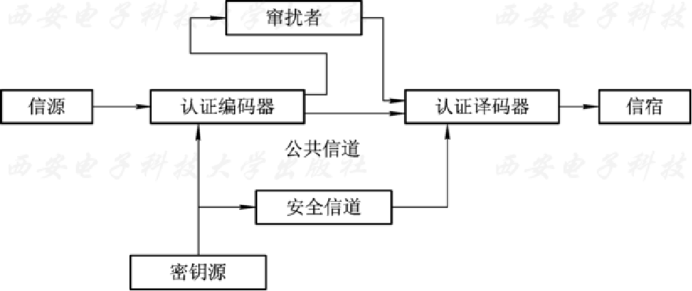
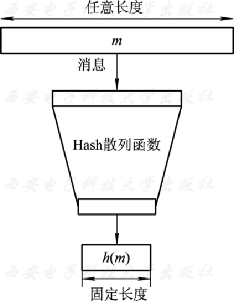
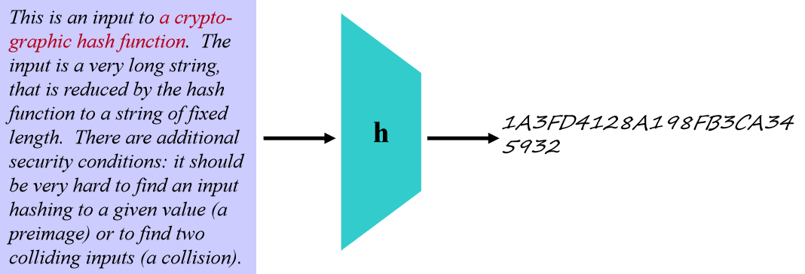
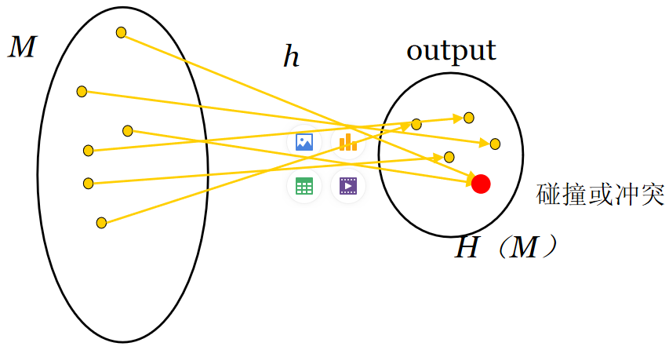

# 信息认证与hash函数
## 认证与认证系统
* **认证**（Authentication），又称为鉴别。认证往往是许多应用系统中安全保护的第一道设防，也是防止主动攻击的重要技术，在现代密码学中有着非常重要的作用。

::: tip 认证的作用（目的）
认证的目的有两个方面：
* 验证信息的发送者是合法的，而不是冒充的，即实体认证，包括信源、信宿的认证和识别；
* 验证消息的 **完整性** ，验证数据在传输和存储过程中是否被篡改、重放或延迟等。
:::

* 认证至少涉及到两个独立的通信实体。而认证参数一般有多种形式，如口令、标示符、密钥、信物、智能卡、指纹、视网纹等。一般说来，利用人的生理特征参数进行认证的安全性高，但技术要求也高，至今尚未普及。
* 目前广泛应用的还是基于密码的认证技术。认证的主要目的是确保报文发送者和接收者的真实性以及报文的完整性。
* 纯认证系统模型由认证编码器、密钥源和认证译码器三部分组成 。

* 消息认证的过程如下：首先，由发送方的认证编码器对发出的消息生成认证信息；然后，将消息和认证信息一起通过公开信道发送给接收方；最后，接收方收到消息和认证信息后，由认证译码器验证消息的合法性，如果消息合法便接受，否则将其丢弃。
* 根据产生认证消息方式的不同，认证分为下面三类：
    * (1)消息认证：用消息的密文本身充当认证信息。
    * (2)消息认证码(Message Authentication Code，MAC)：由以消息和密钥作为输入的公开函数产生的认证信息，也称“消息摘要”或“报文摘要”。
    * (3)散列值：以消息作为唯一输入的散列函数产生的认证信息（无需密钥）

## hash函数的定义
* Hash函数也称为杂凑函数或散列函数，其输入为一可变长度x，返回一==固定长度串==，该串被称为输入x的Hash值（==消息摘要==），还有形象的说法是数字指纹。
* 散列函数H是一个公开函数，不需要密钥，用于将任意长的消息M映射为较短的、固定长度的一个值 $H(M)$。对于散列函数 $H$ ，有下面六个要求：
    * （1）能够接受 **任意长度** 的消息作为输入；
    * （2）能够生成较短的 **固定长度** 的输出；
    * （3）对任何消息的输入都应该能够容易和快速地计算出散列值；
    * （4）应该是一个==单向函数==——难以或不可能反推，也就是说，给定$H(m)$，恢复m在计算上是**不可行**的；
    * （5）应该能够==抵抗弱冲突==，即给定消息m1和H(m1), 找到另一个消息m2 ≠m1 ,使H(m1)=H(m2)是不可能的。
    * （6）应该能够==抵抗强冲突==，即找到两个有意义的消息m1和m2，使得H(m1)=H(m2)几乎是不可能的。 

## Hash函数的一般安全特性
* 单向性（抗原像）：对干任意给定的消息，计算其哈希值容易. 但是，对于给定的哈希值h，要找到M使得H(M)＝h在计算上是不可行的.
* 弱抗碰撞（抗二次原像）：即给定消息m1和H(m1), 找到另一个消息m2 ≠m1 ,使H(m1)=H(m2)是不可能的。
* 强抗碰撞：找任意一对不同的消息M1，M2 ，使H(M1)＝H(M2 )在计算上是不可行的.

## 哈希函数的发展
最初，散列函数主要是为了验证数据完整性，可以说是早期校验算法（如奇偶校验，CRC循环冗余校验）的一种扩展，用于保证网络上传输的信息不会因为物理介质的原因变得不可信赖，但后来用来保证某个信息的合法性，并用在非交互零知识证明和现有的签名算法中。目前，散列函数在安全领域得到了广泛的应用。
 
* 目前在信息安全中，最常用的散列函数有两大系列：Message Digest（MD）系列和SHA（Security Hash Algorithm）系列，而MD5、SHA－1是当前国际通行的两大散列函数。
* MD5曾经是最广泛的摘要算法，但自从在美国加州圣巴巴拉召开的国际密码学会议（Crypto’2004）上山东大学的王小云教授做了破译MD5、HAVAL－128、MD4和RIPEMD算法的报告后，MD5散列算法已不安全，不再推荐使用。但是目前仍然在很多场合还在使用MD5算法，如Linux操作系统中的用户口令的验证算法。 

## 常用散列函数
最常用的散列函数主要可分为如下几类：
### 1. MessageDigest（MD）系列
MD系列是由国际著名密码学家图灵奖获得者兼公钥加密算法RSA的创始人Rivest设计，包括MD2（1989年针对8位计算机上实现），MD4（1990年针对32位计算机上实现）和MD5（1991年提出的，是对MD4的改进版，包括其散列值为128位）。

### 2. SHA（Security Hash Algorithm）系列
美国专门制定密码算法的标准机构NIST（National Instituteof Standard and Technology，美国国家标准技术研究所）和NSA（National SecurityA gency，国家安全局）于1993年在MD5基础上 提出的。 
* SHA-0 
    * SHA-0正式地称作SHA，这个版本在发行后不久被指出存在弱点. 
* SHA-1
    * SHA-1是NIST于1994年发布的，它与MD4和MD5散列算法非常相似，被认为是MD4和 MD5的后继者. 
* SHA-2
    * SHA-2实际上分为SHA-224、SHA-256、SHA-384和SHA-512算法.   

SHA-1，SHA-256的分组大小是512
SHA-384，SHA-512的分组大小是1024
SHA-1输出的摘要是160bit
SHA-256输出的摘要是256
SHA-384输出的摘要是384
SHA-512输出的摘要是512

## Hash函数的用途
消息完整性检测
Hash链用于口令认证
数字签名（速度快；防止消息伪造）
消息完整性和消息源认证（MAC） 

### 消息完整性检测
    “网站卫士”是一个网络安全软件产品。它的主要功能是通过网络扫描网站的网页，监测网页是否被修改，当发现网页被修改后，系统能够自动报警和恢复。
初始化过程
     （1）对监视网站的文件备份到监控主机上。
     （2）对每个备份的文件生成一个结构：文件位置、文件的哈希值。

监控过程
     监控主机对监控网站进行轮回扫描，对扫描的文件进行如下操作：
   （1）计算文件的哈希值，并与备份的文件哈希值进行比较，如果相同，转（4）步。
    （2）如果不同，上载备份文件替换网站现有文件，转（4）步。
    （3）如果备份文件不存在，则删除网站上这个文件，        	转（4）步。
    （4）监控程序扫描下一文件。

### 口令认证
口令认证常见的Unix系统口令以及多数论坛/社区系统口令都是经MD5处理后保存其摘要信息串；
