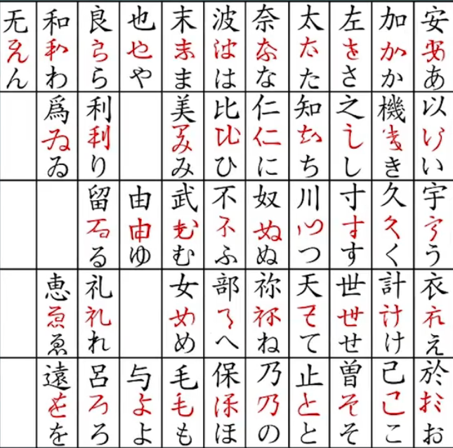

# 基本概念
## 平假名与片假名
平假名和片假名是日语书写系统中的两种主要音节文字，它们起源于不同的历史背景，且各自在现代日语中承担不同的角色。

---

### **平假名的历史**
**1. 起源**：  
- 平假名的形成可追溯到日本平安时代（794-1185），当时女性在文学创作中使用平假名尤为普遍。  
- 平假名起源于草书体汉字，书写方式流畅圆滑。例如，汉字「安」演变为平假名「あ」。  

**2. 发展**：  
- 在早期，平假名被称为「女手（おんなで）」，因为主要用于女性文学和私人信件，而男性倾向于使用汉字书写正式文件。  
- 日本最早的长篇小说《源氏物语》就是用平假名创作的。  

**3. 规范化**：  
- 明治时代（1868-1912），日本政府规范了平假名的形状和发音，最终形成现代的46个基本字符。  

**应用场景**：  
1. **语法功能**：表示助词、助动词、动词变形（如「が」、「を」、「ました」）。  
2. **注音功能**：标注汉字的读音（振り仮名）。  
3. **儿童书籍**：由于学习简单，儿童书籍通常以平假名为主。  

---

### **片假名的历史**
**1. 起源**：  
- 片假名出现在奈良时代（710-794）或稍晚的平安时代，最初用于佛教僧侣的文献注解。  
- 片假名是从汉字的偏旁和部首简化而来的。例如，「加」的片假名为「カ」，「也」的片假名为「ヤ」。  

**2. 发展**：  
- 片假名的早期使用多用于简化文书和记录佛教经典。  
- 它被称为「男手（おとこで）」，因主要在僧侣和男性中流行。  

**3. 规范化**：  
- 与平假名类似，片假名在明治时期得以规范化，并广泛应用于现代社会。  

**应用场景**：  
1. **外来语和借词**：用于书写外来语（如「コンピュータ」）。  
2. **特殊名词**：外国人名、地名等（如「ロンドン」）。  
3. **拟声拟态词**：表示声音或状态（如「ピカピカ」）。  
4. **技术术语**：科技领域常用片假名书写。  

---

### **平假名与片假名的对比与现代应用**

| **属性**      | **平假名**                                   | **片假名**                              |
|---------------|-------------------------------------------|----------------------------------------|
| **起源**      | 草书体汉字                                  | 汉字偏旁、部首                          |
| **特征**      | 线条圆滑，书写流畅                          | 线条直硬，书写简洁                      |
| **应用场景**  | 语法功能词、儿童书籍、标注汉字读音          | 外来语、拟声词、特殊名词、技术术语        |
| **社会功能**  | 表示日本文化与语言的核心部分                | 表现国际化、现代化的外来语和科技术语      |

---

### **两者共同构建现代日语**
- 平假名和片假名与汉字共同构成日语的三种书写方式，在现代书写中缺一不可。  
- 平假名承担语法功能，片假名用于外来表达，汉字承载主要词汇和语义。三者结合，使日语的书写系统既精确又多样化。  

通过平假名和片假名的对比和应用理解，可以更深入掌握日语文字系统的特点和历史背景。在学习中，建议优先掌握平假名，再逐步学习片假名的使用规则。

日语的书写系统复杂多样，包含 **平假名**、**片假名**、**罗马音** 和 **日本汉字**，它们各自具有独特的作用和使用场景。以下是详细介绍：

---

### 1. **平假名（ひらがな）**
**作用**：平假名是日语书写中最基础的文字，用于表示日语中固有的语法功能词和词尾变化。  
**特点**：  
- **发音**：每个平假名代表一个音节，例如「あ (a)」、「い (i)」、「う (u)」。  
- **用途**：  
  1. 表示助词和助动词（如「が」、「を」、「です」）。  
  2. 表示词尾变化（如「食べます」中的「べます」）。  
  3. 用作注音标注（振り仮名），帮助读者标注汉字发音。  
- **适用场景**：初学者常用平假名来熟悉日语，因为其用法简单且覆盖常用语法。

---

### 2. **片假名（カタカナ）**
**作用**：片假名主要用于外来语、拟声拟态词以及特殊名词。  
**特点**：  
- **发音**：与平假名发音对应，例如「ア (a)」、「イ (i)」、「ウ (u)」。  
- **用途**：  
  1. 外来语和借词（如「コンピュータ」表示“电脑”）。  
  2. 外国人名（如「ジョン」表示“John”）。  
  3. 拟声拟态词（如「ドキドキ」表示“心跳的声音”）。  
  4. 技术术语或强调（如「ポケモン」）。  
- **适用场景**：适合表示现代日语中与国际化相关的内容。

---

### 3. **罗马音（ローマ字）**
**作用**：罗马音是用拉丁字母表示日语发音的书写方式，方便非母语者学习发音或输入日语。  
**特点**：  
- **体系**：主流的有三种表示法：  
  1. **Hepburn式**：接近英语发音（如「東京」写作 *Tokyo*）。  
  2. **训令式**：官方推荐，但偏离实际发音（如「東京」写作 *Tookyoo*）。  
  3. **日本式**：接近日语拼音输入（如「東京」写作 *Toukyou*）。  
- **用途**：  
  1. 电脑和手机输入法。  
  2. 为外国人标注日语发音。  
  3. 国际化场合，如护照、标牌等。  
- **适用场景**：对日语初学者和外国人尤为重要，但不用于正式书写。

---

### 4. **日本汉字（漢字）**
**作用**：汉字承载了日语中的核心词汇和主要语义信息。  
**特点**：  
- **发音**：汉字通常有两种读音：  
  1. **音读**：源自中文的读法（如「学生」读作 *がくせい*）。  
  2. **训读**：日语原生的读法（如「山」读作 *やま*）。  
- **用途**：  
  1. 表达名词、动词根和形容词根（如「学校」表示“学校”）。  
  2. 减少歧义：日语中许多词同音不同义，汉字帮助区分意义。  
  3. 文化承载：保留了大量日本文学与文化的精髓。  
- **适用场景**：汉字是日语书写不可或缺的部分，但需要大量记忆。

---

### 比较与总结
| 类型   | 表达的核心内容                  | 使用场景                                    |
|--------|---------------------------------|--------------------------------------------|
| 平假名 | 日语语法功能、助词和词尾变化    | 初学者、日常书写、语法注解                  |
| 片假名 | 外来语、拟声拟态词、特殊强调    | 技术术语、国际化场合、品牌名称              |
| 罗马音 | 日语的拉丁化书写                | 输入法、国际场合、初学日语者发音学习        |
| 日本汉字 | 主要词汇、语义信息              | 学术、文学、正式书写                        |

---

### 实际应用
在学习日语时，四者需结合使用：  
1. **初期阶段**：熟悉平假名和片假名，用罗马音辅助发音学习。  
2. **中级阶段**：引入汉字学习，以减少阅读歧义。  
3. **高级阶段**：全面掌握四种书写方式的综合运用，能够适应日语的多样性书写需求。