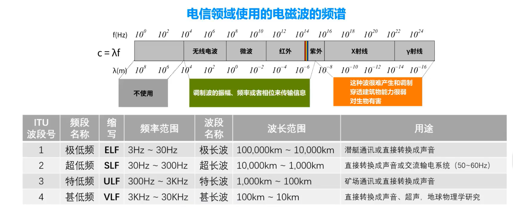

# 电磁波与无线电波

## 一、电磁波基础知识

### 1. 什么是电磁波？

电磁波是由**变化的电场和磁场**相互激发、交替传播所形成的一种能量波动，它是一种**横波**，不需要介质（可以在真空中传播），速度为**光速：约 3 × 10⁸ m/s**。

> 简单说：电磁波 = 摇晃的电场 + 摇晃的磁场，相互带动，像“跳双人舞”一样前进。

---

### 2. 电磁波的组成

* 电场（E）与磁场（B）互相垂直，二者都垂直于传播方向。
* 例如：若电场上下震荡，磁场就左右震荡，而波向则向前传播。

---

### 3. 电磁波的频率与波长

每一种电磁波可以用两个参数表示：

| 参数           | 定义                |
| ------------ | ----------------- |
| **频率 f**（Hz） | 每秒振动次数（越高频率，波越紧凑） |
| **波长 λ**（m）  | 两个相邻波峰之间的距离       |

它们关系为：

> **c = f × λ**
> （c为光速，约3×10⁸ m/s）

---

## 二、电磁波的种类（按频率/波长分类）

电磁波其实是一个巨大的“频谱”，从低频到高频依次包括：

| 名称          | 波长范围            | 频率范围               | 举例           |
| ----------- | --------------- | ------------------ | ------------ |
| **无线电波**    | > 1 mm          | < 300 GHz          | 广播、电视、Wi-Fi等 |
| **微波**      | 1 mm \~ 1 cm    | 300 MHz \~ 300 GHz | 微波炉、雷达、5G    |
| **红外线**     | 700 nm \~ 1 mm  | 300 GHz \~ 430 THz | 体温、遥控器、夜视仪   |
| **可见光**     | 400 \~ 700 nm   | 430 \~ 750 THz     | 眼睛能看见的光      |
| **紫外线**     | 10 nm \~ 400 nm | 750 THz \~ 30 PHz  | 紫外线杀菌、晒黑     |
| **X射线**     | 0.01 \~ 10 nm   | 30 PHz \~ 30 EHz   | 医学成像、安检      |
| **γ射线（伽马）** | < 0.01 nm       | > 30 EHz           | 核反应、宇宙射线     |

> **无线电波是所有电磁波中能量最低的类型。**

---

## 三、什么是无线电波？

无线电波是**频率低、波长长**的电磁波，范围是从 3 Hz 到 300 GHz。根据频率，它又可以分为多个波段：

| 频段名    | 缩写      | 频率范围            | 用途            |
| ------ | ------- | --------------- | ------------- |
| 超长波    | VLF     | 3 \~ 30 kHz     | 潜艇通信，导航       |
| 长波     | LF      | 30 \~ 300 kHz   | 航空导航、AM广播     |
| 中波     | MF      | 300 \~ 3000 kHz | AM广播          |
| 短波     | HF      | 3 \~ 30 MHz     | 国际广播、业余无线电    |
| 超短波    | VHF     | 30 \~ 300 MHz   | FM广播、电视、对讲机   |
| 特高频    | UHF     | 300 \~ 3000 MHz | 手机通信、Wi-Fi、雷达 |
| 微波/毫米波 | SHF/EHF | >3 GHz          | 5G、卫星通信、雷达    |

---

## 四、电磁波对身体的影响原理

你提到的核心问题是：

> “既然我们周围充满无线电波、电磁波，为什么我们感受不到？有没有影响？”

### 1. 能量强度决定影响力

电磁波对人体是否有影响，主要取决于它的**频率（能量）**和**强度（功率密度）**。

* **频率越高，能量越强**。比如X射线、γ射线可以破坏DNA（电离辐射）。
* **功率越强，影响越大**。比如在微波炉里，功率上千瓦，能迅速加热食物。

无线电波处于电磁波中**能量最小**的范围，它们的单个光子能量低得离谱（不足以破坏分子键）：

> E = h × f（h 是普朗克常数）

举个对比：

| 类型   | 能量（每个光子）           | 是否电离辐射？ |
| ---- | ------------------ | ------- |
| 无线电波 | \~10⁻⁸ eV          | ❌       |
| 微波   | \~10⁻⁵ eV          | ❌       |
| 可见光  | \~1 \~ 3 eV        | ❌       |
| 紫外线  | \~5 \~ 10 eV       | ⚠️部分可电离 |
| X射线  | \~1 keV \~ 100 keV | ✅       |
| γ射线  | > MeV              | ✅       |

所以：**无线电波不能电离原子或分子，对身体结构基本没有直接损害能力**。

---

### 2. 热效应

虽然无线电波不具电离性，但高强度的电磁波可以加热物体，这叫**热效应**。

* 微波炉用的是 2.45 GHz 的微波，专门选择能让水分子高速振动。
* 手机、Wi-Fi、广播的电磁波强度远远不够引起组织温升。

国际电磁辐射安全标准（ICNIRP、FCC等）都有严格限制，保证普通人接受的电磁波功率远低于危险值。

---

### 3. 我们感受不到的原因

* **感官无法感知**：我们的眼睛只对“可见光”频率范围有感知；耳朵对机械波（声音）敏感；无线电波频率太高（几百万Hz）或太低（不能形成声音），无法直接感知。
* **电磁透明性**：我们身体对长波（如无线电波）是“透明”的，信号能直接穿过而不被吸收。
* **强度太弱**：大部分无线信号的强度是微瓦、纳瓦级别，远低于自然背景噪声（比如太阳和宇宙背景辐射）。

---

## 五、是不是“热闹非凡”？

是的，从“物理现象”角度来说，**我们周围的空间确实是热闹非凡**：

* 数以万计的广播频道同时在空气中传播；
* 手机、Wi-Fi、蓝牙、卫星通信、雷达同时在不同频率工作；
* 还有自然界的电磁现象：雷电、太阳风、地球磁场扰动……

但从“生物感知”和“物理能量”的角度来看：

> 这些波大多数“无声无息”，像一群在你身边翩翩起舞的影子，但你既看不到、听不到，也不会感到热或震动。

---

## 六、总结：我们与电磁波的“和平共处”

| 维度           | 说明                        |
| ------------ | ------------------------- |
| **是否存在？**    | 存在于所有空间，全天候无处不在           |
| **是否有影响？**   | 绝大多数无线电波功率低，非电离，不会对身体造成伤害 |
| **为什么感受不到？** | 频率不在人类感知范围内，功率太弱，身体组织不吸收  |
| **是否需要担心？**  | 在规范使用下（手机、Wi-Fi等），不用担心    |

---

如果你有兴趣，我还可以进一步解释：

* 如何科学检测电磁波（如频谱仪、电磁强度计）；
* 为什么飞机、医院对某些无线信号有限制；
* 电磁污染、电磁兼容（EMC）的问题；
* 甚至：为什么天文望远镜要建在“无线电静区”。

是否想继续深入？
